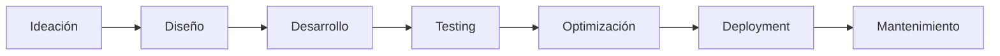

<div align="center">
  
  
  
  # 🚀 CENSNNOVA - Equipo de Innovación Tecnológica
  
  ### *Transformando ideas en experiencias digitales extraordinarias*
  
  [](https://github.com/censnnova-bit)
  [](https://github.com/censnnova-bit)
  
</div>

---

## 👥 Sobre Nosotros

**CENSNNOVA** es un equipo multidisciplinario de innovación tecnológica dedicado a crear soluciones digitales que rompen paradigmas. Combinamos creatividad, tecnología de vanguardia y metodologías ágiles para desarrollar proyectos que destacan por su calidad visual, rendimiento técnico y experiencia de usuario excepcional.

### 🎯 Nuestra Misión

Impulsar la transformación digital mediante el desarrollo de soluciones innovadoras que integren diseño, tecnología y creatividad para generar experiencias memorables.

---

## 💼 Áreas de Especialización

<div align="center">

| 🎨 **Frontend Development** | 🔧 **Optimización Web** | 📱 **Responsive Design** |
|:---------------------------:|:-----------------------:|:------------------------:|
| HTML5 · CSS3 · JavaScript | Performance · GPU Acceleration | Mobile First · Adaptive |

| 🌐 **UI/UX Design** | ⚡ **Animaciones** | 🛠️ **Frameworks** |
|:-------------------:|:------------------:|:-----------------:|
| Interfaces Inmersivas | CSS Animations · 3D Transforms | Tailwind CSS · Modern Stack |

</div>

---

## 🛠️ Stack Tecnológico

### Lenguajes & Frameworks

```javascript
const CENSNNOVA_Stack = {
  frontend: {
    markup: ['HTML5', 'Semantic HTML'],
    styling: ['CSS3', 'Tailwind CSS', 'SASS/SCSS'],
    scripting: ['JavaScript ES6+', 'Vanilla JS'],
    animations: ['CSS Animations', 'Keyframes', '3D Transforms']
  },
  design: {
    visual: ['Glassmorphism', 'Neumorphism', 'Gradients'],
    effects: ['Parallax', 'Particles', 'Backdrop Filters'],
    patterns: ['Responsive Design', 'Mobile First', 'Progressive Enhancement']
  },
  optimization: {
    performance: ['GPU Acceleration', 'Code Splitting', 'Lazy Loading'],
    compatibility: ['Cross-browser', 'Touch Devices', 'Accessibility']
  },
  tools: {
    versionControl: ['Git', 'GitHub'],
    deployment: ['GitHub Pages', 'CI/CD'],
    packageManagers: ['npm', 'Node.js']
  }
};
```

### 📊 Composición de Proyectos

```
HTML/CSS       ███████████████████████████████████░░ 85%
JavaScript     ██████████████████░░░░░░░░░░░░░░░░░ 45%
Frameworks     ████████████████████████░░░░░░░░░░░ 60%
Design         ████████████████████████████████████ 95%
```

---

## 🌟 Portafolio de Proyectos Destacados

**Experiencia web interactiva con interfaz espacial inmersiva**

<div align="center">
  
  
  
</div>

[🔗 Ver Demo](https://censnnova-bit.github.io/super-duper-telegram/) | [💻 Ver Código](https://github.com/censnnova-bit/super-duper-telegram)

---

## 👨‍💻 Nuestro Equipo

<div align="center">
  
  
  
  ### *Juntos creamos el futuro digital*
  
</div>

Un equipo apasionado por la tecnología y la innovación, con expertise en:

- 🎨 **Diseño de Interfaces**: Creación de experiencias visuales únicas
- 💻 **Desarrollo Frontend**: Código limpio y optimizado
- 🚀 **Performance**: Optimización y mejores prácticas
- 📐 **Arquitectura Web**: Soluciones escalables y mantenibles

<div align="center">
  
</div>

---

## 🏆 Reconocimientos y Logros

<div align="center">
  
  
  
  
  
  
</div>

Nuestro trabajo ha sido reconocido por su calidad, innovación y creatividad en el desarrollo web moderno.

---

## 🤝 Desarrollos

<div align="center">
  
  
  
  
</div>

Trabajamos en conjunto con diversos equipos y organizaciones para llevar proyectos al siguiente nivel.

---

## 📈 Metodología de Trabajo

### 🔄 Nuestro Proceso



1. **📋 Planificación**: Análisis de requisitos y definición de objetivos
2. **🎨 Diseño**: Creación de mockups y prototipos interactivos
3. **💻 Desarrollo**: Implementación con las mejores prácticas
4. **🧪 Testing**: Pruebas exhaustivas de funcionalidad y rendimiento
5. **🚀 Deployment**: Entrega y puesta en producción
6. **🔧 Mantenimiento**: Soporte continuo y mejoras

---

## 🎯 Algunas de nuestras APPS

<div align="center">
  
  
  
</div>

### ✨ Innovación
- Implementación de tecnologías de vanguardia
- Soluciones creativas a problemas complejos
- Constante actualización tecnológica

### 🎨 Diseño
- Interfaces intuitivas y atractivas
- Experiencias de usuario memorables
- Atención al detalle visual

### ⚡ Performance
- Código optimizado y eficiente
- Carga rápida y experiencia fluida
- Aceleración por hardware

<div align="center">
  
  
  
</div>

### 📱 Responsive
- Mobile-first approach
- Adaptable a todos los dispositivos
- Consistencia cross-platform

---

## 📊 Estadísticas de GitHub

<div align="center">
  
  
  
  
  
</div>

---

## 🌐 Nuestros Servicios

- 🎨 **Desarrollo Frontend**: Aplicaciones web modernas y responsivas
- 🚀 **Optimización Web**: Mejora de rendimiento y SEO
- 📱 **Diseño UI/UX**: Interfaces centradas en el usuario
- 💡 **Consultoría**: Asesoramiento en arquitectura y tecnología
- 🔧 **Mantenimiento**: Soporte y actualizaciones continuas

---

## 📬 Contacto & Colaboración

<div align="center">

### 💼 ¿Tienes un proyecto en mente?

Nos encantaría colaborar contigo para crear algo extraordinario.

[](https://github.com/censnnova-bit)
[](mailto:contact@censnnova.dev)
[](https://censnnova-bit.github.io/super-duper-telegram/)

</div>

---

## 💡 Filosofía de Trabajo

> "No solo creamos código, creamos experiencias. Cada proyecto es una oportunidad para innovar, sorprender y superar expectativas."

### 🎯 Nuestros Valores

- **🚀 Innovación**: Siempre buscando nuevas formas de resolver problemas
- **🎨 Creatividad**: Diseños únicos que destacan
- **⚡ Excelencia**: Calidad en cada línea de código
- **🤝 Colaboración**: Trabajo en equipo y comunicación efectiva
- **📚 Aprendizaje**: Constante actualización y mejora

---

## 🎓 Habilidades Técnicas

### Frontend Development


### Tools & Platforms


### Design & Prototyping


---

<div align="center">

### ⭐ Si te gusta nuestro trabajo, considera seguirnos

```
     _____ ______ _   _  _____ _   _ _   _  ______      __     
    / ____|  ____| \ | |/ ____| \ | | \ | |/ __ \ \    / //\   
   | |    | |__  |  \| | (___ |  \| |  \| | |  | \ \  / //  \  
   | |    |  __| | . ` |\___ \| . ` | . ` | |  | |\ \/ // /\ \ 
   | |____| |____| |\  |____) | |\  | |\  | |__| | \  // ____ \
    \_____|______|_| \_|_____/|_| \_|_| \_|\____/   \//_/    \_\
                                                                
```

**Hecho con 💙 y ☕ por el equipo CENSNNOVA**

*Innovación · Creatividad · Excelencia*


---

**© 2025 CENSNNOVA - Todos los derechos reservados**

</div>
